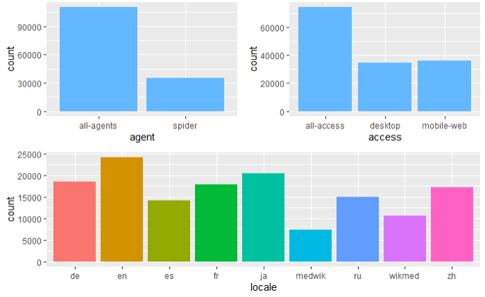
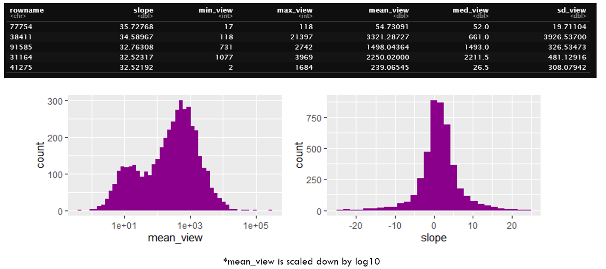
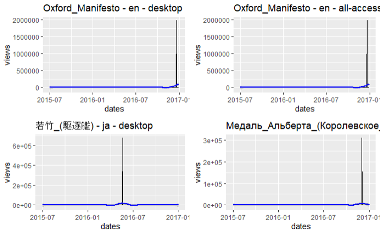
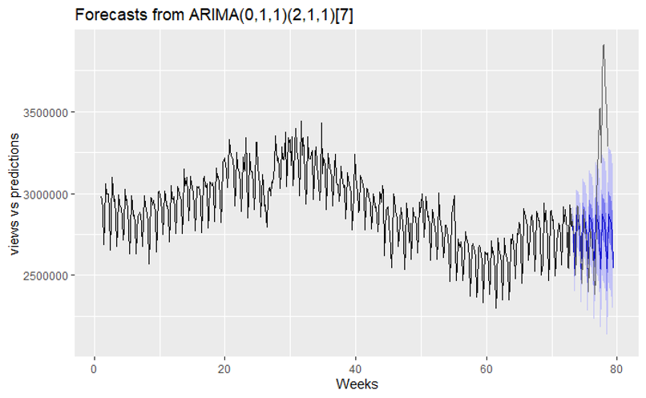
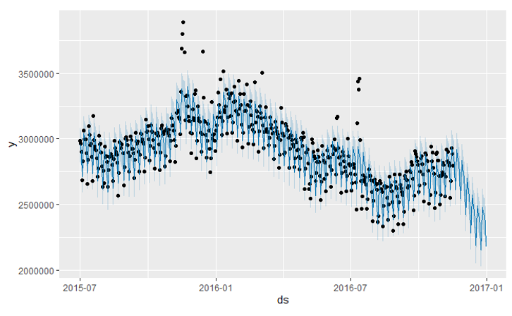
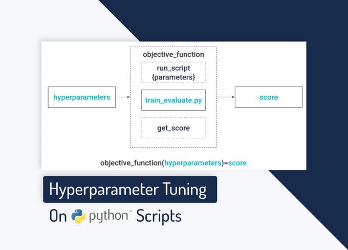

# Web-Traffic-Forecasting---Capstone

This project looks at the problem of forecasting future values of time-series data. Wikipedia has over 145,000 articles and their view counts available to analyze. Following the Exploratory Data Analysis (EDA) process I was able to develop an Auto-Regressive Integrated Moving Average (ARIMA) model that showed a prediction of view counts for the following 45 – 60 days. Web forecasting is gaining popularity and has many applications including load balancing for cloud services, and understanding user behavior.

## Code and Resources Used
**R Version:** 4.1.0\
**R Packages:** ggplot2, plotly, ggthemes, gridExtra,, corrplot, scales, tibble, RColorBrewer, data.table, lubridatae, broom, lazyeval, tidyverse, dplyr, tidyr, forecast, prophet\
**Data Source:** https://www.mediawiki.org/wiki/API:Main_page | https://www.kaggle.com/c/web-traffic-time-series-forecasting

---

## What is Web Traffic Forecasting?
* Predict web traffic trends based on historic data
* Develop strategies for Load balancing applications
* Better understand user behavior

## Potential Customers
 Businesses looking for insights on web traffic to improve efficiency and gain a competitive edge\
 Forecasting is ubiquitous across industries:
 * Operations
 * Retail
 * Marketing
 * Logistics

## Exploratory Data Analysis (EDA)
### Software:
**R with Rstudio:** tidyverse, plotly, forecast, prophet, ggplot2, dplyr

## Data source:
Source: https://www.kaggle.com/c/web-traffic-time-series-forecasting/data \
Approximatley 145,000 time series:
* Daily page views, 2015-07-01 to 2016-12-31

## Cleaning and Transformation
* Checked for missing values using is.na 
* Seperated the date and pages to seperate tibbles for visualization
* Renamed and restructured page values to be easier to work with

### Time-series Extraction

## The Variables:
* locale data includes 7 languages: German, English, Spanish, French, Japanese, Russian, and Chinese
* Access: Platform used to view page
* Agent being a real person and spider being a bot used to index content

## Understanding Trends
### Looking for any trends in the distribution
* Broken down by min, max, mean, median, standard deviation, and slope

## Outliers
Clear examples of outliers. Zero views for all dates, spikes to over 10^6
 * tsclean() from forecast library does well with these values

## Model Selection - Arima
### Stands for Auto Regressive Integrated Moving Average
* **ARIMA** has 3 terms AR, I, and MA
* (AR) corresponds to Lags of the stationarized series
* (MA) corresponds to lags of the forecast error
* (I) corresponds to order of differencing of series to make it stationary
* Captures complex relationships through an iterative process of regressing a variable: Views ~ Dates\

*AR Model*: This model forecasts future values based on the immediate prior value in the time-series\
*MA Model*: equal to the past error multiplied by the coefficient

## Auto.Arima Results
### Prediction Length of 45 Days

## Residuals
* Strong p-value = 0 .017 (less than 0.05)
* Residuals are normally distributed
* Mostly absent of autocorrelation 

## Prophet Model
* Implementation of the Prophet library
* Non-linear trends are fitted with yearly seasonality effects

* Prophet components plotted
* Clear dip in views for middle of the year

## Improvements
* Include more relevant dates - Kaggle and API only provided up to 2016 
* Determine specific seasonality effects and tune accordingly
* Overall increase in model performance

